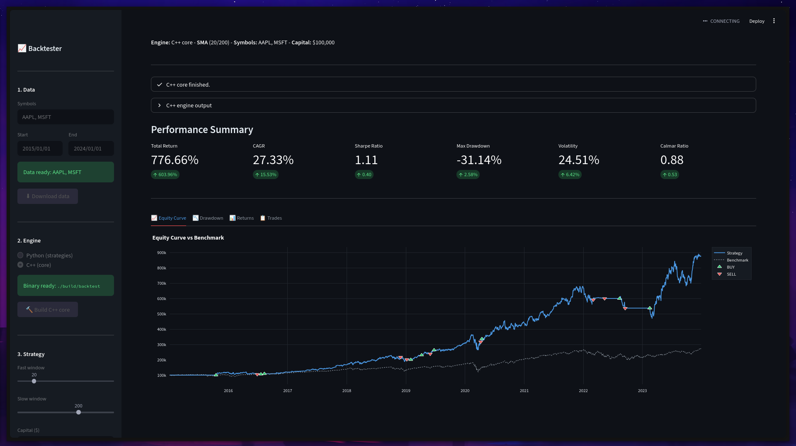

# Event-Driven Backtesting Engine

Moteur de backtesting event-driven implémenté en deux langages avec une interface Streamlit unifiée.

```
DataHandler  →  MarketEvent
Strategy     →  SignalEvent
Portfolio    →  OrderEvent
Broker       →  FillEvent  →  Portfolio::update()
```



## Structure

```
backtest/
├── core/                   ← moteur C++17 (performance-critical)
│   ├── include/
│   │   ├── events.hpp      # std::variant<MarketEvent, SignalEvent, OrderEvent, FillEvent>
│   │   ├── bar.hpp         # struct OHLCV
│   │   ├── data_handler.hpp
│   │   ├── strategy.hpp    # base Strategy + SMACrossStrategy
│   │   ├── portfolio.hpp
│   │   ├── broker.hpp      # fill au open, commission 0.1%
│   │   ├── performance.hpp # Sharpe, CAGR, Max DD, Calmar
│   │   └── export.hpp      # export CSV
│   └── src/
│       └── main.cpp
│
├── strategies/             ← moteur Python (reference implementation)
│   ├── events.py
│   ├── data_handler.py
│   ├── strategy.py
│   ├── portfolio.py
│   ├── broker.py
│   ├── performance.py
│   └── runner.py
│
├── app.py                  ← Streamlit, point d'entrée unique
├── scripts/
│   └── download_data.py
├── CMakeLists.txt
├── Justfile
└── pyproject.toml
```

## Quickstart

### 1. Télécharger les données
```bash
just download AAPL,MSFT
# ou: python scripts/download_data.py AAPL MSFT --start 2015-01-01 --end 2024-01-01
```

### 2. Compiler le core C++
```bash
just build
# ou: cmake -B build -DCMAKE_BUILD_TYPE=Release && cmake --build build -j4
```

### 3. Lancer l'interface
```bash
just app
# ou: streamlit run app.py
```

Choisir le moteur dans la sidebar : **Python strategies** (inline) ou **C++ core** (subprocess + CSV).

### Workflow complet en une commande
```bash
just all AAPL,MSFT
```

## Engines

| | Python `strategies/` | C++ `core/` |
|---|---|---|
| Dispatch | `queue.Queue` + `if/elif` | `std::queue` + `std::visit` |
| Events | dataclasses | `std::variant` |
| Data | yfinance live | CSV pre-downloaded |
| Output | inline Streamlit | `results/*.csv` |
| Usage | prototypage rapide | backtest longue période |

## Docker

```bash
docker compose up --build
```

Ouvre `http://localhost:8501`. Les dossiers `data/` et `results/` sont montés en volume local — les données et résultats persistent entre les redémarrages.

## Métriques

Total Return / CAGR / Sharpe / Max Drawdown / Volatilité annualisée / Calmar — comparées au benchmark (SPY par défaut).

## Docker

```bash
docker compose up --build
```

Ouvre `http://localhost:8501`. Les dossiers `data/` et `results/` sont montés en volume local — les données et résultats persistent entre les redémarrages.
